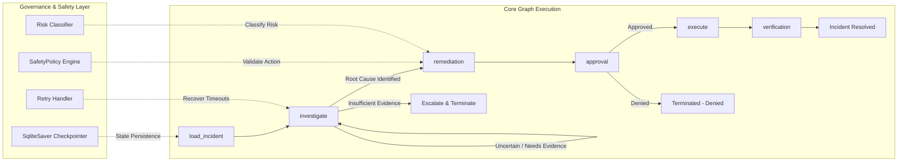

# System Architecture & Design Document

## Executive Overview
The **Incident Management Agent** is an autonomous production incident triage, investigation, and remediation system designed for high availability and safety. It operates as a directed state machine built on **LangGraph**, combining deterministic safety controls with evidence-based reasoning.

---

## Architecture & Data Flow



---

## Key Subsystems & Design Rationale

### 1. Graph State Management (`IncidentState`)
The agent state is defined as a total typed dictionary (`IncidentState`) tracking:
- `evidence`: Lineage of evidence items collected from production tools.
- `hypotheses`: Competing hypotheses with confidence scores, supporting, and contradicting evidence.
- `proposed_action`: Planned remediation action with risk score, rationale, and evidence citations.
- `approval_status` & `approved_by`: Human-in-the-loop approval record.
- `timeline` & `errors`: Complete execution timeline and recorded error trace.

### 2. Decision & Investigation Engine
- **Multi-Hypothesis Tracking**: The decision engine maintains multiple hypotheses (e.g. `auth-service TLS cert expired` vs `api-gateway v7.2.0 deploy`).
- **Confidence Dynamics**: Confidence moves with empirical log and config evidence. Decoy hypotheses (e.g. recent deploys that expose rather than cause the fault) are assigned low confidence when contradicted by log timestamps.
- **Evidence-Driven Tool Calls**: Tool calls (`search_logs`, `get_config`, `get_deploys`, `check_health`) are dynamically selected based on missing state information.

### 3. Knowledge Retrieval & Relevance Engine (`agent/knowledge`)
- **Runbook Lookup**: Queries internal knowledge base for relevant runbooks.
- **Relevance Validation**: Filters out false matches. For example, when evidence points to expired TLS certificates, past runbooks recommending `restart_service` (like `INC-2025-0912`) are explicitly rejected as non-viable because restarting a service does not renew an expired x509 certificate.

### 4. Production Safety Policy (`agent/safety`)
- **Risk Classification**: Actions like `update_config`, `rollback_deploy`, `restart_service`, `scale_service`, `drain_traffic` are classified as `high` risk.
- **Security Control Guards**: Scans proposed parameters for dangerous patterns (`disable_tls`, `verify_upstream_tls=false`, `disable_auth`) and raises a `SafetyViolation` if detected.
- **Approval Gating**: Gated by explicit human approver callback or LangGraph `interrupt(...)`. No high-risk action can execute without human approval.

### 5. Reliability & Chaos Handling (`agent/reliability`)
- **Tool Timeout Recovery**: Wrap tool invocations in `call_with_retry` with exponential backoff and jitter up to `DEFAULT_MAX_RETRIES = 3`.
- **Idempotency**: Remediation actions check current state before execution to prevent duplicate application.

### 6. Persistence & Checkpointing
- Uses `SqliteSaver` checkpointer keyed on `thread_id`. If the process is terminated at any step (e.g., during human approval), resuming with the same `thread_id` restores state intact without losing evidence or timeline history.

---

## Live Change Scenarios

### 1. Adding a new high-risk action `drain_traffic`
1. Add `drain_traffic` to `HIGH_RISK_ACTIONS` in `agent/safety/risk.py`.
2. Add tool specification in `agent/tools/registry.py` with `risk='high'`, `read_only=False`.
3. Add safety policy validation rules in `agent/safety/policy.py`.
4. Add unit test verifying `classify_risk("drain_traffic", "api-gateway") == "high"`.

### 2. Adding SEV1 Time-of-Day Approval Rule
Modify `agent/safety/policy.py` to check current system time:
```python
if alert.get("severity") == "SEV1" and is_outside_business_hours(current_time):
    if len(approvers) < 2:
        raise SafetyViolation("SEV1 incidents outside business hours require dual approval.")
```
