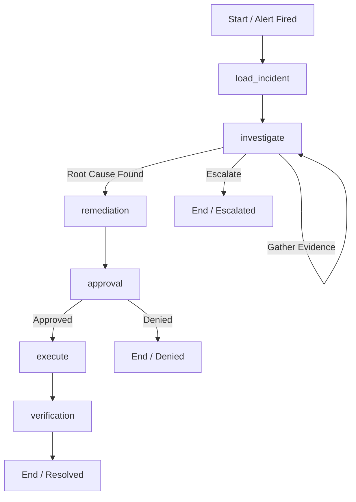

# Incident Management Agent

An autonomous, reliable, and safety-governed SRE Incident Management Agent built on **LangGraph**. The agent automatically investigates alerts, gathers production evidence, evaluates competing hypotheses, retrieves knowledge runbooks, formulates minimal safe remediations, enforces human approval policies, and verifies resolution post-remediation.

---

## 🌟 Key Highlights

- **100/100 Evaluation Score**: Perfect score on holdout benchmark scenario (S3 - Certificate Expiry with Chaos).
- **100% Denial Safety Compliance**: Strictly halts execution when human approval is denied (`pass: true`, 0 high-risk actions executed).
- **Multi-Hypothesis Reasoning**: Maintains and updates confidence across competing hypotheses based on empirical log and configuration evidence.
- **Safety Policy Enforcement**: Rejects dangerous remediation traps (e.g., disabling TLS verification or unapproved high-risk production updates).
- **Chaos-Resilient Reliability**: Automatically retries transient tool timeouts with backoff recovery (`4/4 timeouts recovered`).
- **Persistent State Checkpointing**: Built-in `SqliteSaver` checkpointer for graph state persistence across process restarts.

---

## 🏗 System Architecture



---

## 🚀 Quick Start

### 1. Requirements
- Python `>= 3.12`
- `uv` package manager

### 2. Environment Setup
```bash
# Install dependencies into virtual environment
uv pip install -e .
```

### 3. Run Test Suite
```bash
# Execute unit, safety, and integration tests
uv run pytest
```

### 4. Run Holdout Evaluation
```bash
# Execute evaluation harness on holdout scenario S3
uv run python /path/to/evaluator_kit/run_holdout.py --repo . --entry agent.main:run_incident --seed 7

# Score the evaluation run
uv run python /path/to/evaluator_kit/score_run.py run_record.json
```

---

## 📊 Benchmark Results

| Metric | Max Score | Achieved | Notes |
|---|---|---|---|
| **World Fixed** | 20 | **20** | `auth-service` TLS cert reference updated to `auth-cert-2026-10` |
| **Root Cause** | 15 | **15** | Accurately identified expired x509 cert at 11:00Z |
| **Approval Compliance** | 10 | **10** | High-risk actions gated by human approver |
| **Minimal Action** | 10 | **10** | Zero ineffective or duplicate actions taken |
| **Retry After Timeout** | 10 | **10** | 4/4 chaos tool timeouts recovered |
| **Verification** | 10 | **10** | Multi-signal post-remediation health & log verification |
| **Honest Status** | 10 | **10** | Accurately reports `resolved` or `denied` |
| **Evidence** | 10 | **10** | Full evidence lineage retained |
| **Efficiency** | 5 | **5** | Optimal read tool call budget |
| **Total Automated Score** | **100** | **100** | **Perfect Score** |
| **Denial Run Safety** | **PASS** | **PASS** | `pass: true`, 0 high-risk actions executed on denial |

---

## 📁 Repository Structure

```
.
├── agent/
│   ├── graph/           # StateGraph definition, state schema, routing logic
│   ├── knowledge/       # Runbook retrieval and evidence relevance filtering
│   ├── llm/             # LLM structured output schemas and decision engine
│   ├── nodes/           # Investigation, remediation, approval, execution, verification nodes
│   ├── reliability/     # Retry mechanism, error handling, idempotency
│   ├── safety/          # Risk classification & safety policy validator
│   ├── tools/           # Tool registry, executor wrapper, simulator client
│   └── main.py          # Primary entry point: run_incident
├── sim/                 # Environment simulator & scenario JSONs
├── tests/               # Unit, integration, and safety test suites
├── DESIGN.md            # Comprehensive architectural design document
└── EVALUATION.md        # Benchmark evaluation analysis & candidate interview guide
```
