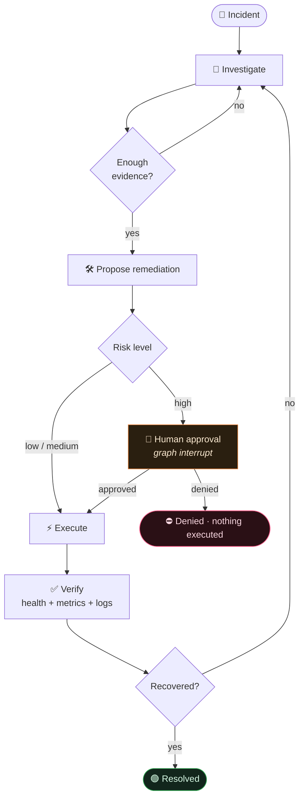
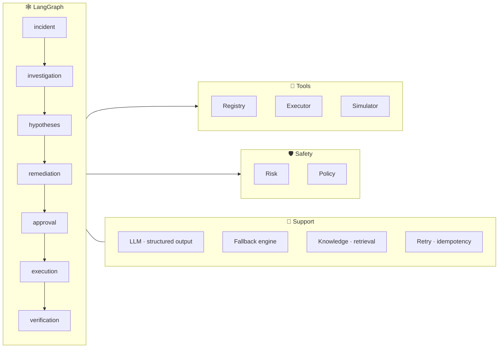

<div align="center">


<a href="https://git.io/typing-svg">
  
</a>

<br/>


<br/>

**[Overview](#-overview) · [How it works](#-how-it-works) · [Architecture](#-architecture) · [Safety](#-safety-first) · [Scenarios](#-scenarios) · [Quickstart](#-quickstart) · [Limitations](#-honest-limitations)**

</div>

<br/>

## ✨ Overview

**Sentinel** is an AI-driven agent that investigates production incidents, finds the likely root cause, proposes the *smallest* safe fix, asks a human before anything risky, and then **independently verifies** that the system actually recovered.

> It is **not** an LLM chat loop. It's a stateful, graph-orchestrated agent with tool use, competing hypotheses, bounded retries, risk policy, human-in-the-loop approval, and durable checkpoints.

```text
🚨 Login failures up · API returning HTTP 502
        │
        ▼
🔎 Investigate  →  🧾 Evidence  →  🧠 Hypotheses  →  🎯 Root cause
        │
        ▼
🛠  Remediate  →  ⚖️ Risk check  →  🙋 Approval  →  ⚡ Execute  →  ✅ Verify
```

<br/>

## 🧭 How it works



**Read** (investigate) and **write** (remediate) are strictly separated. The agent investigates freely, but changes to production only happen behind policy and approval.

<br/>

## 🧩 Features

<table>
<tr>
<td width="50%" valign="top">

### 🧠 Reasoning
- **Competing hypotheses** with confidence that moves as evidence arrives
- **Structured evidence** that *supports* or *contradicts* each hypothesis
- LLM **chooses the next useful tool**, no blind tool-spamming
- **Knowledge retrieval** with relevance checks: past incidents are hints, not answers
- Admits when **no runbook exists** instead of hallucinating one

</td>
<td width="50%" valign="top">

### 🛡️ Safety
- **Agent-side** risk classification and policy, not just simulator enforcement
- **Human approval** for high-risk actions via LangGraph interrupts
- **Defense in depth**: re-checked again at execution time
- **Blocks security-degrading fixes** (e.g. disabling TLS verification)
- **Minimal remediation**: smallest action that solves the actual problem

</td>
</tr>
<tr>
<td width="50%" valign="top">

### 🔁 Reliability
- **Bounded retries** for transient failures (`ToolTimeout`)
- No pointless retries on invalid requests (`ToolError`)
- **Persistent SQLite checkpointing**: crash, restart, resume on the same `thread_id`
- Idempotency guards on write actions

</td>
<td width="50%" valign="top">

### ✅ Verification
- Action success ≠ incident resolved
- Independent post-fix checks: **health + metrics + logs**
- If not recovered → **loops back to investigation**
- **Honest status**: `resolved` / `denied` / `not_resolved`, never fake success

</td>
</tr>
</table>

<br/>

## 🏗 Architecture



<details>
<summary><b>📁 Project structure</b></summary>

```text
agent/
├── main.py                 # entry point: run_incident(sim, thread_id, approver)
├── graph/
│   ├── graph.py            # graph assembly
│   ├── state.py            # shared incident state
│   └── routing.py          # conditional edges
├── nodes/
│   ├── incident.py
│   ├── investigation.py
│   ├── hypotheses.py
│   ├── remediation.py
│   ├── approval.py
│   ├── execution.py
│   └── verification.py
├── tools/
│   ├── simulator.py
│   ├── investigation.py
│   ├── remediation.py
│   ├── health.py
│   ├── registry.py         # controlled tool surface
│   └── executor.py         # the only path to writes
├── safety/
│   ├── policy.py
│   └── risk.py
├── knowledge/
│   ├── retrieval.py
│   └── relevance.py
├── llm/
│   ├── prompts.py
│   ├── schemas.py          # ToolRequest, RemediationPlan, ...
│   ├── model.py
│   └── fallback.py         # deterministic engine, no API key
├── reliability/
│   ├── retry.py
│   ├── errors.py
│   └── idempotency.py
└── utils/
    ├── logging.py
    └── timeline.py
tests/ · docs/ · DESIGN.md · EVALUATION.md · pyproject.toml
```

</details>

<details>
<summary><b>🧾 Core data model</b></summary>

```text
State
├── thread_id · alert · status
├── evidence[]            id · source · data · supports · contradicts · timestamp
├── hypotheses[]          e.g. H1 TLS cert expired (0.75) · H2 gateway deploy (0.20) · H3 cache (0.05)
├── selected_hypothesis
├── proposed_action · alternative_actions
├── approval_status · approved_by
├── action_result · verification
├── retries · errors · timeline
└── investigation_round · investigation_complete · last_decision
```

</details>

<br/>

## 🛡 Safety first

```text
LLM ──✗──▶ production write            (never directly)

LLM ──▶ proposed action ──▶ risk policy ──▶ approval ──▶ executor ──▶ write
```

| Action | Risk | Gate |
|---|---|---|
| `scale_service` | 🟢 low | policy check |
| `flush_cache` | 🟡 medium | policy check |
| `restart_service` | 🟡 medium | policy check |
| `rollback_deploy` | 🔴 high | **human approval** |
| `update_config` | 🔴 high | **human approval** |

**The TLS trap.** When TLS handshakes fail, the tempting "fix" is `verify_upstream_tls = false`. It makes the error vanish by weakening security. Sentinel's policy rejects it and fixes the *actual* cause instead.

<br/>

## 🎬 Scenarios

| | Scenario | Root cause | Correct, minimal fix |
|---|---|---|---|
| **S1** | 🚀 Bad deployment | `payments-api` deploy → `db_pool_size` → connection-pool exhaustion | valid remediation found via tools |
| **S2** | 🗄 Database saturation | `reporting-job` hogging `orders-db` connections → checkout failures | `restart reporting-job` |
| **S3** | 🔐 Hidden certificate incident | `auth-service` cert expired → TLS handshake fails → gateway 502 | `update_config auth-service tls_cert_ref=auth-cert-2026-10` *(high risk, needs approval)* |

**S3 decoys the agent correctly rejects:** a recent gateway deployment, session-cache degradation, and a historical "restart fixed it" incident that doesn't apply here.

<br/>

## 📊 Results

<div align="center">

| Metric | Result |
|:---|:---:|
| Hidden holdout (approval mode) | **100 / 100** |
| Denial mode: high-risk actions executed | **0** · status `denied` |
| Injected timeouts recovered | **4 / 4** |
| Unit tests | **14 passing** |
| Needs an API key to test | **No** |

</div>

<br/>

## 🚀 Quickstart

```bash
# 1. clone
git clone https://github.com/<your-username>/sentinel.git
cd sentinel

# 2. install
uv sync

# 3. run tests (no API key required, uses the deterministic fallback engine)
uv run pytest

# 4. optional: enable the structured LLM engine
export OPENAI_API_KEY="sk-..."
```

**Programmatic entry point**

```python
from agent.main import run_incident

result = run_incident(sim, thread_id="incident-001", approver=my_approval_callback)
print(result["status"])   # resolved | denied | not_resolved
```

> Re-invoking with the same `thread_id` resumes from the last SQLite checkpoint, even after a process crash.

<br/>

## 🧪 Tests

Coverage spans **safety**, **reliability**, **knowledge**, and **scenarios**, all runnable offline.

```bash
uv run pytest -v
```

<br/>

## ⚠️ Honest limitations

- Runs against a **controlled incident simulator**, not live infrastructure
- **Limited tool set**; no Kubernetes or real cloud integration
- Human approval remains **required** for risky actions
- LLM behavior needs **broader evaluation** beyond the provided scenarios
- Production use would need stronger **identity, authorization, audit, and secrets management**

> Sentinel provides the **reasoning, orchestration, safety, and verification architecture** for an SRE agent, demonstrated against a controlled simulator.

<br/>

## 📚 Docs

- [`DESIGN.md`](DESIGN.md): architectural decisions and trade-offs
- [`EVALUATION.md`](EVALUATION.md): evaluation approach and results

<br/>

<div align="center">

**Built with 🧠 LangGraph · 🛡 safety-first design · ☕ a lot of late-night debugging**


</div>
